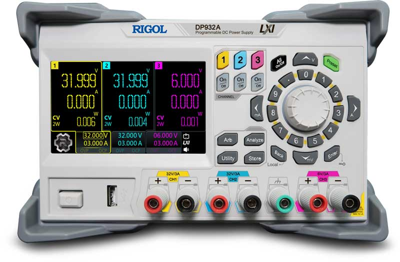
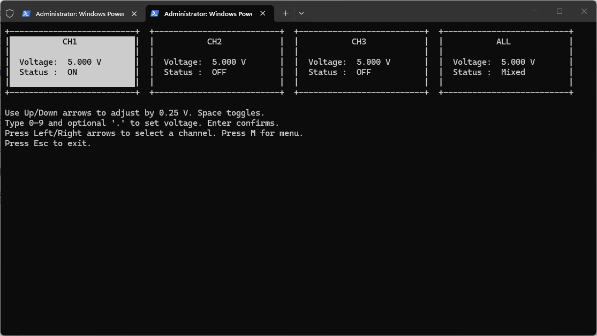

# pyrigol

Python control for Rigol DP900 series power supplies over USB or serial using
PyVISA, with both a scripting-friendly CLI and an interactive TUI.



## Features

- CLI for scripting and automation.
- Interactive TUI with per-channel control plus an ALL channel.
- USB auto-discovery with serial (ASRL) support.

## Requirements

- Python 3.12+
- `uv`
- NI-VISA (Windows) or another VISA implementation that provides `visa32.dll`
  for USB discovery.

## Install

```sh
uv sync
```

## Quickstart

List VISA resources:

```sh
uv run pyrigol --list
```

Set voltages and enable outputs over USB:

```sh
uv run pyrigol --resource "USB0::0x1AB1::0x0E11::DP9XXXXXXXX::INSTR" --ch1 5.0 --ch2 3.3 --ch3 1.8 --output-on
```

Turn outputs off after setting voltages:

```sh
uv run pyrigol --resource "USB0::0x1AB1::0x0E11::DP9XXXXXXXX::INSTR" --ch1 5.0 --ch2 3.3 --ch3 1.8 --output-off
```

Single-channel output control:

```sh
uv run pyrigol --resource "USB0::0x1AB1::0x0E11::DP9XXXXXXXX::INSTR" --ch1 5.0 --ch2 3.3 --ch3 1.8 --output-on 2
```

## TUI

The TUI auto-discovers the first USB VISA resource when `--resource` is not
provided.



Launch:

```sh
uv run pyrigol-tui
```

Controls:

- Left/Right arrows: select channel (CH1, CH2, CH3, ALL).
- Up/Down arrows: adjust voltage by step size (default 0.25 V).
- `0-9` + optional `.`: type a voltage value (max 2 digits before and 3 after
  the decimal).
- Enter: confirm typed voltage.
- Space: toggle output (selected channel).
- M: open the menu (step size + auto-apply).
- Esc: exit (with confirmation prompt).

Channel limits:

- CH1/CH2: 0.00-32.00 V
- CH3: 0.00-6.00 V

ALL channel behavior:

- Voltage updates are applied to all channels and clamped to each channel's
  min/max.
- Status shows `ON`, `OFF`, or `Mixed` when primary channels differ.

## Windows Executable (TUI)

Build the standalone Windows executable:

```sh
pwsh build/windows/build.ps1
```

Output:

```text
dist/pyrigol-tui.exe
```

## EFT Test Script

The EFT script steps all three channels together based on Enter presses. It
auto-discovers the first USB VISA resource when no arguments are provided.

```sh
uv run python scripts/eft_test_script.py
```

To use a specific resource:

```sh
uv run python scripts/eft_test_script.py --resource "USB0::0x1AB1::0x0E11::DP9XXXXXXXX::INSTR"
```

## Serial (ASRL) Notes

If your device enumerates as `ASRLx::INSTR`, use the serial options:

```sh
uv run pyrigol --resource "ASRL4::INSTR" --baud-rate 115200 --ch1 3.3 --ch2 3.3 --ch3 1.8 --output-on
```

If `*IDN?` times out on serial, try skipping it and adjusting terminations:

```sh
uv run pyrigol --resource "ASRL4::INSTR" --baud-rate 115200 --read-term "\n" --write-term "\n" --no-idn --ch1 3.3 --ch2 3.3 --ch3 1.8 --output-on
```

## Troubleshooting

- "NI-VISA is not available": Install NI-VISA and ensure `visa32.dll` is
  present on the system PATH.
- "No USB VISA resources found": Confirm the device is connected via USB and
  the driver is installed. Some devices enumerate under NI-VISA only.

## Development

Enable repo-managed git hooks:

```sh
git config core.hooksPath .githooks
```
